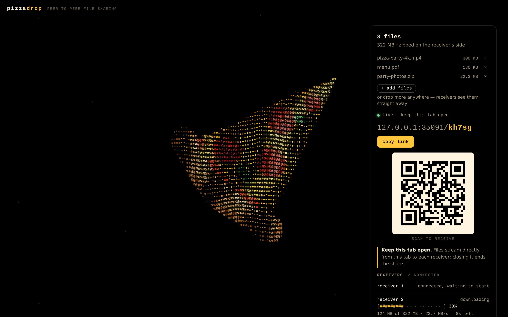
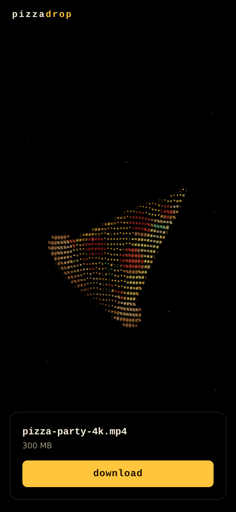

# PizzaDrop

Send files of any size straight from your browser to someone else's. Drop a file, get a short link and a QR code, and
keep the tab open while they download. The file never touches a server: it streams peer-to-peer over an encrypted
WebRTC data channel, and every 4 MiB block is SHA-256 verified before it's written to disk.

It runs either as one small Node process (app + signaling), or as a plain static site with no backend at all, e.g.
**GitHub Pages** or **Cloudflare Pages**: see [Static hosting](#static-hosting-github-pages-cloudflare-pages).



<p align="center"></p>

- **No size limit.** Both ends stream: the sender reads the file in 4 MiB blocks and the receiver writes straight to
  disk. Memory stays flat: during a 1 GB transfer, all headless Chrome processes together peaked at 1.2 GB, up from
  1.0 GB idle (`npm run bench` reports this).
- **Nothing unverified reaches the disk.** The sender hashes each 4 MiB block with the browser's native SHA-256 as it
  reads it; the receiver checks every block before writing it. A damaged block is simply fetched again (and the UI
  says so), instead of throwing away a whole download.
- **Short links** like `https://pzza.app/x7k4q`: 5 characters from an alphabet with no `0/O/o`, `1/l/I/i`.
- **QR code** generated in the browser, standard polarity, error correction level Q. It encodes the plain `https://`
  link.
- **Many receivers at once**, each with its own connection, progress bar, speed and ETA.
- **Resumes** from the last verified block if a receiver's connection drops.
- **Multiple files** stream back to back with no pause between them and are zipped on the fly on the receiver's side.
- **Add files to a live share.** Drop more files (or use **+ add files**) while sharing: receivers see them straight
  away, and anyone who already downloaded can fetch just the new ones. Files can be removed too, and a removed file is
  never sent again.
- **Animated colour-ASCII pizza** on a pure black page, with a static version for `prefers-reduced-motion`. The 404
  page gets a whole pizza in the same style, slowly turning clockwise.

---

## How it works

```
  Sender tab                     Signaling server (Node + ws)              Receiver tab
  ──────────                     ────────────────────────────              ────────────
  drop file
  {t:"host"}  ─────────────────▶ issues code "x7k4q"
  link + QR  ◀─────────────────  {t:"hosted"}
                                                         ◀──────────────── open /x7k4q  {t:"join"}
  {t:"peer-joined"} ◀──────────  introduces the peers
  offer / ICE ─────────────────▶ relays ──────────────────────────────────▶ answer / ICE
  ◀───────────────────────────── relays ◀────────────────────────────────── (both ways)

  ══════════════ RTCDataChannel — DTLS-encrypted, browser to browser ══════════════
  manifest (ids, names, sizes) ─────────────────────────────────────────▶ shows files, [Download]
  ◀─────────────────────────────────────────────────────────────────────── request(files [0,1,2], offset 0)
  block(file 0, offset 0, 4 MiB, sha256) ───────────────────────────────▶ assemble the block
  256 KiB binary chunks ────────────────────────────────────────────────▶ SHA-256 ✓ → write to disk
  ◀─────────────────────────────────────────────────────────────────────── ack(bytes finished)  ← flow control
  block … file-end(0) · block … file-end(1) … ──────────────────────────▶ no round trip between files → Done ✓
  manifest (a file was added) ──────────────────────────────────────────▶ [Download 1 new file]
```

- The **signaling server** only issues codes and relays WebRTC session descriptions and ICE candidates. It never
  sees file contents, file names or sizes: the manifest travels over the data channel.
- A **code** lives until the sender stops sharing or closes the tab (released immediately on `pagehide`, or after a
  20 s grace period if the socket just drops). It also expires after 24 h without signaling activity. Codes are
  case-insensitive, and joins are rate-limited per IP so codes can't be enumerated.
- **Multiple files** are sent back to back, and the receiver zips them on the fly (STORE, zip64-capable) into a
  single `pizzadrop-<code>.zip`. Zipping happens on the receiver's side so every block can still be verified and
  resumed individually, and so the zip's exact size is known up front. Files added later arrive as a second download
  (`pizzadrop-<code>-2.zip`, or the file itself if it's just one).

## Tech choices

- **Vite + React + TypeScript** for the client. It's a single-page app with two routes (`/` and `/<code>`), so a
  static SPA fits better than an SSR framework like Next.js. Vite also handles the Web Workers and the fixed-name
  service worker build with no extra tooling. Runtime dependencies are `react`, `react-dom`, `@noble/hashes`
  (SHA-256 fallback for plain-`http://` LAN testing, where WebCrypto isn't available), `client-zip` (streaming zip) and `qrcode-generator`.
- **Node.js + `ws`** for the signaling server rather than a Cloudflare Worker + Durable Object. One small process
  serves the built client and the WebSocket on the same origin, with no vendor lock-in. It deploys as a single Docker
  image anywhere, and in-memory rooms are the simplest correct state for short-lived codes. The trade-off is that you
  run one instance: see [Known limits](#known-limits).
- **PeerJS as a backend-free alternative.** The static build (`npm run build:static`) signals through a PeerJS server
  instead, by default the free public one, so the whole app can live on GitHub Pages or Cloudflare Pages.
  `client/src/lib/peerjs.ts` plays the part of the signaling server on top of PeerJS's message relay, so the rest of
  the app doesn't know the difference. No PeerJS library is shipped: it speaks the relay's small JSON protocol directly.

## Repository layout

```
shared/   wire protocol types + validators, short-code generator, formatting helpers
server/   signaling server: rooms & codes, rate limiting, ICE/TURN config, static hosting
client/   web app
  src/ascii/      ASCII pizza: illustration, renderer
  src/lib/        transfer engine: sender, receiver, back-pressure, block hashing, save sinks, signaling
                  (own server or PeerJS)
  src/sw/         service worker for streaming downloads
  src/workers/    OPFS writer worker
  src/pages/      send + receive screens
e2e/      Playwright end-to-end tests (real browsers, real WebRTC) and a throughput benchmark
.github/  GitHub Pages deployment workflow
scripts/  dev runner
```

## Local development

Requires **Node.js ≥ 22.12**.

```sh
npm install
npm run dev            # http://localhost:5173  (Vite; proxies /ws to the signaling server on :8080)
```

Open the page, drop a file, then open the link in another browser window (or a private window) to receive it. To try
it from a phone on the same network, run `npm run dev -- --host`. Some save paths (service worker, OPFS, File System
Access) need a secure context, so plain `http://<lan-ip>` falls back to in-memory downloads. Use an HTTPS tunnel to
test those.

| Script                     | What it does                                                                   |
| -------------------------- | ------------------------------------------------------------------------------ |
| `npm run dev`              | shared (watch) + signaling server (tsx watch) + Vite dev server                |
| `npm run build`            | compile `shared` and `server`, bundle `client` into `client/dist`              |
| `npm run build:static`     | bundle `client` for a static host (PeerJS signaling); see Static hosting      |
| `npm start`                | production server on `$PORT` (default 8080), serving `client/dist` + `/ws`     |
| `npm run check`            | ESLint + Prettier check + typecheck (all packages, e2e, scripts) + unit tests  |
| `npm test`                 | Vitest unit tests (short codes, protocol validation, rooms, back-pressure…)    |
| `npm run test:e2e`         | build first; drives headless Chromium through every save path (see below)      |
| `npm run bench`            | build first; one big transfer, reports MB/s and browser CPU-seconds per GB     |

The e2e suite starts the production server on a free port and runs real WebRTC transfers between browser contexts:
- QR decoding back to the link, and ≤ 15 stars
- every save path, each SHA-256 checked: in-memory, service worker, OPFS, and File System Access (with a stubbed
  picker)
- multi-file zip, including duplicate names and an empty file
- two simultaneous receivers
- a byte flipped in flight: the block fails its check, is fetched again, and the file is byte-identical; a block that
  keeps failing stops the download instead of saving it
- files added to a live share, downloaded as a second batch; a removed file isn't offered, and removing one stops a
  download that still needs it
- a 256 MB transfer whose data channel is killed at 20% and resumes to a byte-identical file; a channel that silently
  stops delivering is noticed, and the download resumes on a fresh connection
- expired links
- the `beforeunload` prompt, and code release when the sender's tab closes
- static rendering under reduced motion; the 404 page's spinning whole pizza (and its 404 status)
- mobile layout with no horizontal overflow
- the static build, served like GitHub Pages under `/p2p-file/` with the 404.html fallback, with a local PeerJS
  server: a service-worker download, a resume after a dropped connection, and an expired link

Set `CHROMIUM_PATH` to point at a Chromium binary and `E2E_BIG_MB` to change the large-file size.

## Deployment

The app needs **HTTPS** in production. Streaming saves, the clipboard API and the service worker all require a secure
context, and phones won't open camera-scanned `http://` links without a warning.

### Docker

```sh
docker build -t pizzadrop .
docker run -d -p 8080:8080 -e PUBLIC_URL=https://pzza.app pizzadrop
```

Or use the compose file, which includes an optional coturn TURN server:

```sh
cp .env.example .env               # edit PUBLIC_URL, TURN_* …
docker compose up -d               # app only
docker compose --profile turn up -d   # app + coturn
```

Put a TLS-terminating reverse proxy in front and make sure it forwards WebSocket upgrades on `/ws`. With Caddy:

```
pzza.app {
    reverse_proxy 127.0.0.1:8080
}
```

Caddy proxies WebSockets automatically. With nginx, add `proxy_set_header Upgrade $http_upgrade;` and
`proxy_set_header Connection "upgrade";` for `/ws`. Set `TRUST_PROXY=true` so rate limiting sees real client IPs.

### One-click-ish hosts

Any Docker host with WebSocket support works. Keep it to **one instance** (rooms live in memory):

- **Fly.io:** `fly launch` (it detects the Dockerfile), set `internal_port = 8080`, then
  `fly secrets set PUBLIC_URL=https://<app>.fly.dev`, then `fly scale count 1`.
- **Render / Railway / Koyeb:** create a Docker web service from this repo, port `8080`, one instance, and set the
  env vars below.

Health check: `GET /healthz` → `{"ok":true,"rooms":…,"receivers":…}`.

### Static hosting (GitHub Pages, Cloudflare Pages)

A static host can't run the WebSocket signaling server, so `npm run build:static` makes a build that signals through a
[PeerJS](https://peerjs.com) server instead: by default the free public one at `0.peerjs.com`. Everything else is
identical: the files still go directly between browsers, block-verified, and the PeerJS server only relays the
connection setup (it never sees file names or contents).

**GitHub Pages** (`https://<user>.github.io/<repo>/`):

1. In the repository, open **Settings → Pages → Build and deployment** and set **Source** to **GitHub Actions**.
   (With "Deploy from a branch", GitHub renders the README instead of the app.)
2. Push to `main`, or run the **Deploy to GitHub Pages** workflow by hand (**Actions** tab). The workflow
   ([`.github/workflows/pages.yml`](.github/workflows/pages.yml)) runs the checks, builds with the right base path
   (`/<repo>/`), copies `index.html` to `404.html` so share links like `/<repo>/x7k4q` open the app, and deploys.

Share links then look like `https://<user>.github.io/<repo>/x7k4qm` (6 characters, see below). To try a static build
locally first: `npm run build:static && npm run preview -w client`. GitHub serves those deep
links from `404.html`, so they arrive with an HTTP 404 status; browsers don't care, but some link-preview bots do.

**Cloudflare Pages** (with your own subdomain):

1. **Workers & Pages → Create → Pages → Connect to Git**, pick this repository.
2. Build command `npm run build:static`, build output directory `client/dist`. Node comes from `.nvmrc`.
   Leave `BASE_PATH` unset: the site is served from `/`.
3. **Custom domains → Set up a custom domain**, e.g. `drop.example.com`. If the domain's DNS is on Cloudflare, the
   record is created for you.
4. Optionally set the build variable `VITE_PUBLIC_URL=https://drop.example.com`, so links always use your domain even
   when someone opens the `*.pages.dev` address.

Cloudflare Pages treats a site without a `404.html` as a single-page app and serves `index.html` for every path, so
links are plain `https://drop.example.com/x7k4q` with a 200 status. Don't add the 404.html copy there.

**Trade-offs of the public PeerJS server**, compared with running `server/`:
- It's a free community service with no uptime guarantee. If it's down, nobody can start a transfer (running
  transfers aren't affected). `VITE_PEERJS_URL` points the build at another PeerJS server, e.g. your own
  (`npx peer --port 9000`), and `VITE_SIGNAL_URL` at a PizzaDrop server (`server/`) running somewhere else.
- It can't rate-limit joins the way `server/` does, so codes are 6 characters (≈ 887 M combinations) instead of 5.
- As with any signaling server, you trust its operator not to tamper with the connection setup (see
  [Known limits](#known-limits)).
- There's no TURN relay unless you add one with `VITE_ICE_SERVERS`, so two peers that are both behind strict NATs
  can't connect. In a public static site, TURN credentials are visible to anyone, so use a TURN service meant for
  that, or one with short-lived credentials.

The workflow reads these as repository **variables** (Settings → Secrets and variables → Actions → Variables):
`SIGNAL_URL`, `PEERJS_URL`, `PEERJS_KEY`, `ICE_SERVERS`, `PUBLIC_URL`.

## Environment variables

### Build time (static builds)

Read by Vite when bundling the client; `client/.env.static` holds the defaults for `npm run build:static`.

| Variable            | Default                          | Meaning                                                                        |
| ------------------- | -------------------------------- | ------------------------------------------------------------------------------ |
| `BASE_PATH`         | `/`                              | Path the site is served under, e.g. `/p2p-file/` for a GitHub Pages project    |
| `OUT_DIR`           | `client/dist`                    | Where the build goes                                                           |
| `VITE_SIGNALING`    | `server` (`peerjs` when static)  | `server`: PizzaDrop's own signaling server. `peerjs`: a PeerJS server          |
| `VITE_SIGNAL_URL`   | `/ws` on the page's origin       | WebSocket URL of a PizzaDrop signaling server hosted elsewhere                 |
| `VITE_PEERJS_URL`   | `wss://0.peerjs.com/peerjs`      | PeerJS server WebSocket endpoint                                               |
| `VITE_PEERJS_KEY`   | `peerjs`                         | PeerJS server key                                                              |
| `VITE_ICE_SERVERS`  | Google + Cloudflare STUN         | JSON array of `RTCIceServer` objects (PeerJS mode; `server/` sends its own)    |
| `VITE_PUBLIC_URL`   | _(page origin)_                  | Origin for share links, e.g. `https://drop.example.com`                        |
| `VITE_CODE_LENGTH`  | `6`                              | Share-code length in PeerJS mode (5 or 6)                                      |

### Server (`server/`)

All optional. See [`.env.example`](.env.example).

| Variable                      | Default                                                    | Meaning                                                                          |
| ----------------------------- | ---------------------------------------------------------- | -------------------------------------------------------------------------------- |
| `PORT` / `HOST`               | `8080` / `0.0.0.0`                                         | Listen address                                                                   |
| `PUBLIC_URL`                  | _(page origin)_                                            | Canonical origin for links/QR codes, e.g. `https://pzza.app`                     |
| `STATIC_DIR`                  | `client/dist`                                              | Built client to serve; empty = signaling only                                    |
| `CODE_LENGTH`                 | `5`                                                        | Share-code length (5–6); a crowded code space auto-extends to 6                  |
| `ROOM_IDLE_TTL_SECONDS`       | `86400`                                                    | A code expires after this long with no signaling activity                        |
| `HOST_GRACE_SECONDS`          | `20`                                                       | How long a code survives the sender's socket dropping (not a clean tab close)    |
| `MAX_PEERS_PER_ROOM`          | `32`                                                       | Concurrent receivers per code                                                    |
| `STUN_URLS`                   | `stun:stun.l.google.com:19302,stun:stun.cloudflare.com:3478` | Comma-separated STUN servers                                                   |
| `TURN_URLS`                   | _(none)_                                                   | Comma-separated TURN URLs, e.g. `turn:turn.pzza.app:3478?transport=udp`          |
| `TURN_USERNAME` / `TURN_CREDENTIAL` | _(none)_                                             | Static TURN credentials                                                          |
| `TURN_SECRET`                 | _(none)_                                                   | coturn `static-auth-secret`: mint short-lived credentials per connection instead |
| `TURN_CREDENTIAL_TTL_SECONDS` | `86400`                                                    | Lifetime of minted TURN credentials                                              |
| `TRUST_PROXY`                 | `false`                                                    | Use `X-Forwarded-For` for rate limiting (only behind your own proxy)             |
| `ALLOWED_ORIGINS`             | _(any)_                                                    | Comma-separated Origins allowed to open `/ws`                                    |

### Adding a TURN server (coturn)

STUN is enough for most home and office networks. When **both** peers are behind symmetric NAT or strict firewalls
(some corporate networks, some mobile carriers), they can't connect directly. The receiver then sees *"Couldn't
connect to the sender directly…"*, and a TURN relay fixes it:

1. Run coturn on a host with a public IP. The `turn` compose profile does this: set `TURN_SECRET` (a long random
   string) and `TURN_EXTERNAL_IP` in `.env`, then open UDP/TCP 3478 and UDP 49160–49400.
2. Point the app at it: `TURN_URLS=turn:<host>:3478?transport=udp,turn:<host>:3478?transport=tcp` and the same
   `TURN_SECRET`.
3. The server then hands each browser credentials that expire after `TURN_CREDENTIAL_TTL_SECONDS` (coturn's TURN REST
   API scheme), so nothing long-lived is exposed. The compose config also blocks relaying into private address
   ranges.

Relayed traffic still carries DTLS-encrypted data: the relay can't read the files, but it does carry their bandwidth.

## Browser support

Automated tests run on Chromium. For the other browsers, the save path listed below is the one this code selects
based on the APIs it detects; those browsers aren't exercised in CI yet.

| Browser                                   | Send | Receive: how the file is saved                                                                 |
| ----------------------------------------- | :--: | ---------------------------------------------------------------------------------------------- |
| Chrome / Edge / Opera desktop (102+)      |  ✓   | **File System Access**: save dialog, bytes written straight into the chosen file (tested)       |
| Chrome Android, Samsung Internet          |  ✓   | **Service-worker stream** into Downloads (the SW path is tested in Chromium)                    |
| Firefox desktop & Android (114+)          |  ✓   | **Service-worker stream** into Downloads                                                        |
| Safari macOS (15.4+, 16.4+ recommended)   |  ✓   | **OPFS**: streamed to a private on-disk file, then handed to Downloads (the OPFS path is tested in Chromium) |
| iOS / iPadOS, any browser (WebKit)        |  ✓\* | **OPFS**, as above                                                                             |
| Anything else with WebRTC                 |  ✓   | **In-memory Blob**: warns before downloads over 500 MB                                          |

\* iOS suspends background tabs, so an iPhone **sender** must keep PizzaDrop in the foreground.

Firefox private windows disable service workers and OPFS, so they fall back to in-memory downloads with the warning.
`?sink=memory|service-worker|opfs|file-system-access` on a receive link forces one path, which is handy for testing.

## Known limits

- **The sender's tab must stay open.** Closing it ends the share (the page warns first). Background tabs keep
  sending, except on iOS.
- **Resuming** works within a page session (network blips, ICE failures, a dropped data channel). A receiver that
  reloads the page starts over, because the partially written file belongs to the old page.
- **Throughput** is bounded by the network and by the browser's own WebRTC stack (SCTP + DTLS), which runs on the
  CPU. In the CPU-starved, GPU-less CI container (both browsers on one 4-vCPU box), raw WebRTC with no app code tops
  out around 30–35 MB/s and PizzaDrop reaches 23–24 MB/s; see [Speed](#speed) for what changed and why. Real
  machines go faster, and LAN transfers are usually disk- or Wi-Fi-bound. Through a TURN relay you get the relay's
  bandwidth.
- **OPFS staging (Safari/iOS)** needs free disk space for the file and then briefly a second copy while the browser
  moves it to Downloads.
- **Files added to a share** reach receivers that already downloaded as a separate download; a zip that's already
  being written can't grow.
- **One server instance.** Rooms live in memory. Scaling out would need routing by code (sticky sessions) or a shared
  store such as Redis pub/sub.
- **Folders** can't be dropped directly. Zip them first, or select the files inside.
- **Zips are uncompressed** (STORE). Most large files are already compressed, and it keeps zipping streaming and
  cheap.
- **Trust model.** The SHA-256 check catches corruption and bugs. It can't catch a malicious sender, who controls
  both the file and the hash. As in any WebRTC app, the data channel's DTLS fingerprints travel via the signaling
  server, so you're trusting whoever runs that server not to swap them. Anyone with the link can download while the
  tab is open, so treat the link like the file.

---

## How it was built

### Streaming, integrity and back-pressure

**Sender.** Each receiver gets its own `RTCPeerConnection` and one ordered, reliable `RTCDataChannel`, so a slow or
dropped receiver can't affect the others. A receiver asks for a list of files (`request`), and the sender streams them
back to back. For each file, `streamBlob()` (`client/src/lib/flow.ts`) reads the `File` one 4 MiB block at a time and
hashes each block with WebCrypto's native SHA-256, reading and hashing the next block while the current one is on the
wire. Before a block's bytes it sends a small `block` header (file id, offset, size, SHA-256); the bytes follow as
messages of up to 256 KiB, capped at the connection's negotiated `sctp.maxMessageSize`. Before every `send()` it checks
two conditions:

1. **Local back-pressure:** `bufferedAmount ≤ 8 MiB`. Otherwise it waits for `bufferedamountlow`, which fires at
   4 MiB, with a 250 ms poll as a safety net. Chrome closes channels whose buffer passes 16 MiB, so this keeps a wide
   margin, while the low mark keeps several megabytes queued for the network while JavaScript refills the buffer.
2. **End-to-end flow control:** no more than 48 MiB sent on the channel but not yet finished with by the receiver.
   WebRTC has no receive-side back-pressure, so without this a receiver with a slow disk would silently buffer the
   whole file in RAM. The receiver acknowledges bytes as its sink *consumes* them (or as it throws them away), not as
   they arrive. The count spans files, so the next file starts streaming immediately instead of after a round trip.

Unit tests pin all of these properties down with a fake channel and fake slow disks:
- `bufferedAmount` never exceeds high-water plus one chunk
- in-flight bytes never exceed the window plus one chunk, across files
- at most one outstanding read, and every block's announced hash matches its bytes
- byte-exact output, resume from a block boundary, prompt abort, and close handling

**Receiver.** Chunks are copied into the block they belong to. When a block is complete, its SHA-256 is computed
(natively, off the main thread) and compared with the header's; blocks are checked in parallel but released in order.
Only a verified block goes on to the file's pull-based `ReadableStream` (`highWaterMark: 0`), which hands it over
when the sink asks for more, and that is what drives the acks. A single file is piped straight into the sink. Several
go through `client-zip`'s `makeZip`. So a verified block is also one 4 MiB disk write, much cheaper than many small
ones.

A block that fails its check is released, not written, and the receiver re-requests from that block (`seq` numbers
tell the sender's leftover bytes from the old request apart from the new ones). The UI reports how many blocks were
repaired. A block that fails three times stops the download and discards what the sink allows (the File System Access
swap file, the service-worker download).

**Resume.** Receivers keep a per-tab client id. If the channel drops, the receiver rejoins through signaling, the
sender recognises the id and replaces that receiver's connection, and the receiver re-requests the rest of its files
starting at the first unverified block. The sink simply continues. A connection can also stall without closing (a
network path that dies quietly), so a download that makes no progress at all for 20 s is treated the same way:
reconnect, resume. Three stalls in a row with nothing written in between end the download with an error instead of
retrying forever.

**Adding files.** Every file has a stable id. The sender re-sends the manifest whenever files are added or removed,
and a receiver keeps track of which ids it has saved, so the next download is just the new ones. Removing a file hides
it from receivers that haven't asked for it and stops any download that still needs it.

### Speed

Measured with `npm run bench` (400 MB, service-worker sink) in the 4-vCPU CI container, against the previous version
of the engine built from the same tree:

| | throughput | browser CPU per GB |
| --- | --- | --- |
| before (JS SHA-256 of every byte, 64 KiB messages) | 17.6–18.5 MB/s | 191–199 CPU-s |
| after | 22.9–24.4 MB/s | 125–133 CPU-s |

500 files of 64 KB went from 4.4–6.0 s to 1.9 s, with no network latency at all; over a real link the old per-file
round trip also cost one RTT per file. Where the time went:

- **Hashing.** The receiver used to run a pure-JavaScript SHA-256 over every byte (≈ 140 MB/s on this box, less on
  phones), a hard ceiling on fast LANs. WebCrypto's native SHA-256 runs at ≈ 1 GB/s here. The sender also no longer
  reads every file twice (once to fingerprint it, once to send it).
- **Message size.** 256 KiB messages instead of 64 KiB: 4× fewer `send()` calls and `message` events. Raw WebRTC alone
  goes 11% faster with them in this container.
- **The animated background.** Drawing the ASCII pizza is a few thousand canvas blits a frame on the main thread,
  where WebRTC's messages are handled too. It now animates at 30 fps while a transfer runs.
- **Round trips between files**, gone as described above.

### The receiver's fallback ladder (`client/src/lib/sinks.ts`)

1. **File System Access** (`showSaveFilePicker` → `createWritable()`). The user picks a location and bytes stream
   into it. Writes go to a swap file that's committed on close or discarded on abort.
2. **Service-worker stream.** The page registers a download with `/sw.js` over a `MessageChannel` and points a hidden
   iframe at `/__pizzadrop/dl/<id>`. The service worker answers with a `Response` whose body is a `ReadableStream`
   fed from the page, carrying `Content-Disposition: attachment` and an exact `Content-Length`, including the
   predicted zip size. The stream's `pull()` reports how much the browser's download manager has taken, and the page
   keeps at most 4 MiB ahead of that, so back-pressure reaches all the way from the disk to the WebRTC sender. A
   keep-alive ping stops Firefox from killing the worker mid-download. If the worker doesn't pick up the request
   within 6 s, the ladder moves on.
3. **OPFS**, used on WebKit, where service-worker downloads are unreliable. A worker writes chunks through a
   `FileSystemSyncAccessHandle`, then the finished, disk-backed `File` goes to the download manager via an object
   URL. Staged files older than an hour are cleaned up on later visits.
4. **In-memory Blob**, the last resort. The UI warns before downloads over 500 MB and asks for confirmation.

### The ASCII renderer (`client/src/ascii/`)

The look follows the reference screenshot supplied for this project:
- a grid of monospace glyphs whose rows ripple like fabric
- bright diagonal bands (`# % @`) sweeping across dimmer `+ * =` troughs
- soft glow on the brightest glyphs

The difference is that here the colours come from a pizza.

1. **Illustration.** `pizzaArt.ts` draws a flat, cartoon pizza slice with canvas paths: puffy crust, a sauce rim,
   cheese with drips and a shaded edge, pepperoni, and basil. It's drawn tip-up and rotated 45° clockwise, so the tip
   points upper-right and the crust sits lower-left.
2. **Layout and sampling** (once per resize). The slice is fitted to 52% of the smaller viewport side (58% on
   phones) and centred. A character grid of about 42 rows covers it. The illustration is rasterised at 4×6 samples
   per cell, and each cell stores its coverage and the nearest of 11 *materials* (cheese, pepperoni, crust…).
3. **Glyph atlas** (once per resize). Every glyph × material × 12 brightness levels is pre-drawn into offscreen
   canvases. Ordinary levels use tight sprites. The top levels get padded sprites with a baked-in glow. Each
   material's colour runs shadow → base → saturated highlight, plus a pale glint at the very top.
4. **Per frame.**
   - Every cell is displaced by two travelling sine waves, which gives the rippling rows.
   - A warped diagonal band field sets its brightness, and a slow term drifts the colours.
   - Brightness picks the colour level and the glyph from the density ramp `. : + * = # % @`.
   - Darker, more saturated materials (pepperoni, sauce, crust) are biased towards denser glyphs and get a brightness
     floor, so they never sink into a dark band.
   - A hashed per-cell flicker adds the occasional sparkle.
   - The frame is one `drawImage` per visible cell, snapped to whole device pixels.
5. **Behaviour.**
   - Everything outside the slice is `#000`, apart from 9–15 (never more than 15) dim, slowly twinkling stars. They're
     placed with rejection sampling, far apart and at least three cells away from the slice.
   - The animation pauses when the tab is hidden.
   - With `prefers-reduced-motion` it renders one static frame.
   - Dragging a file over the page makes the waves speed up and brighten a little. An active transfer does the same,
     more gently, and drops the frame rate to 30 fps to leave the CPU to the transfer.
6. **The 404 page** draws a whole pizza (`drawWholePizza`) in the same style, turning clockwise once every 90 s. The
   glyph grid can't rotate (the glyphs have to stay upright), so the illustration is rasterised once into a 320×320
   map of materials, and every frame each cell looks up which part of the turning pizza is under it. A circle's
   outline doesn't change as it turns, so layout and star placement still happen once per resize. The Node server
   answers any unknown page with this page and a 404 status; GitHub Pages does the same through `404.html`.
